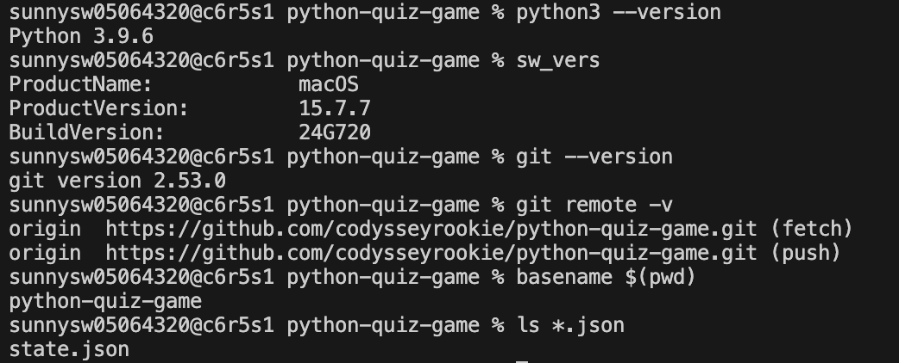
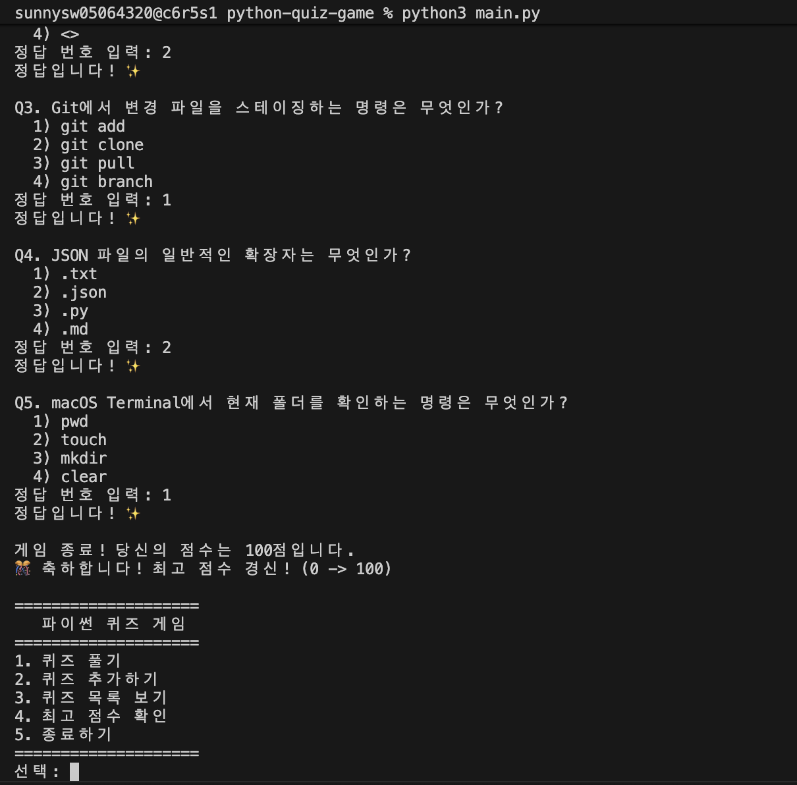
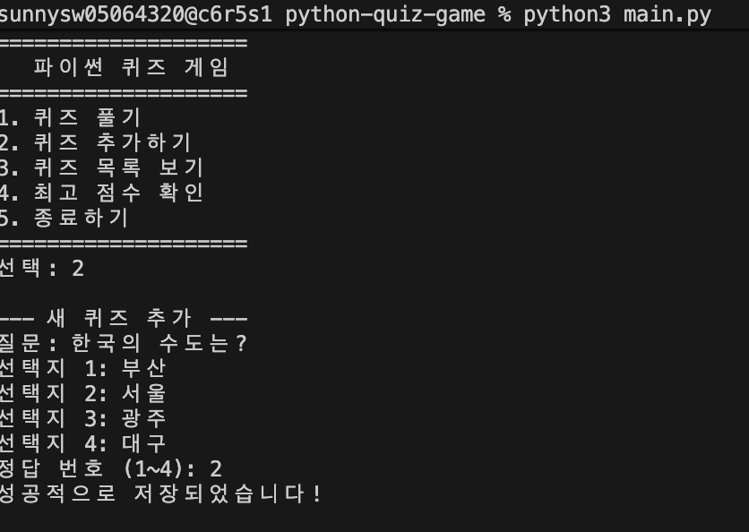
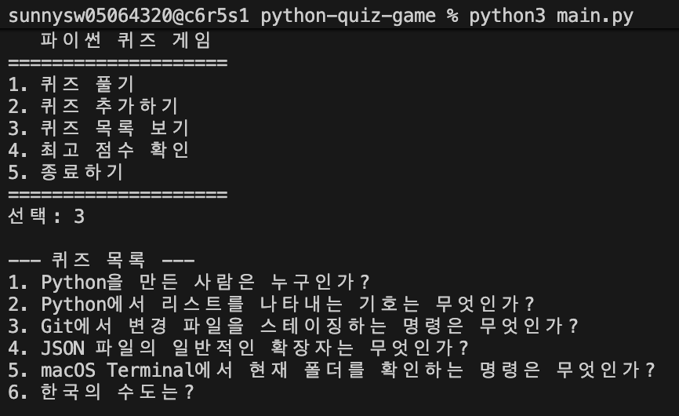
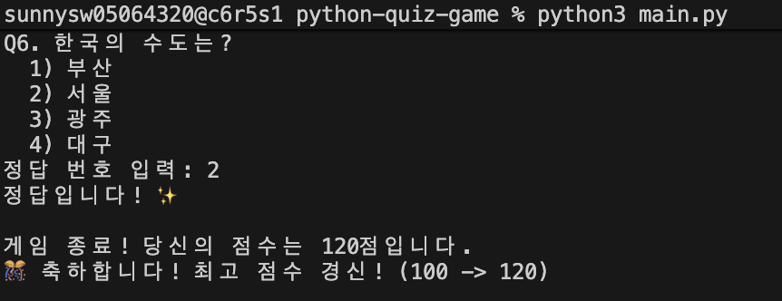
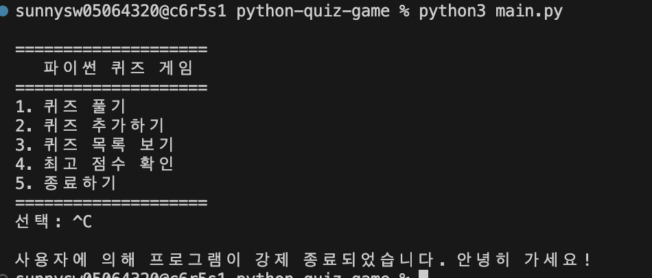
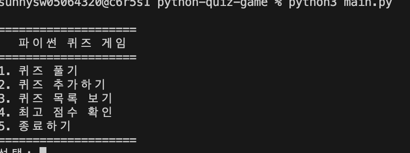
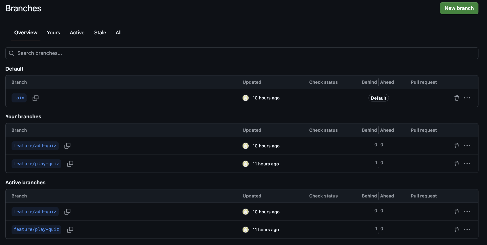
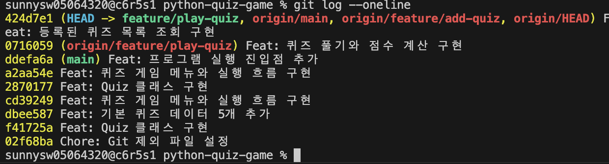

# 나만의 퀴즈 게임

Python 기초 문법, 클래스, 파일 입출력, 예외 처리와 Git·GitHub 사용법을 연습하기 위해 만든 콘솔 기반 객관식 퀴즈 게임입니다.

사용자는 터미널에서 퀴즈를 풀고, 새로운 퀴즈를 추가하고, 등록된 퀴즈 목록과 최고 점수를 확인할 수 있습니다. 퀴즈 데이터와 최고 점수는 `state.json` 파일에 저장되어 프로그램을 다시 실행해도 유지됩니다.


## 1. 프로젝트 개요

- 프로젝트명: 나만의 퀴즈 게임
- 개발 언어: Python
- 실행 환경: macOS Terminal
- 데이터 저장 방식: JSON 파일
- 형상 관리: Git, GitHub
- GitHub 저장소: https://github.com/codysseyrookie/python-quiz-game

```bash
python3 --version
sw_vers
git --version
git remote -v
basename $(pwd)
ls *.json  
```
#### 실행 증빙 파일 경로



---

## 2. 퀴즈 주제 선정 이유

기본 퀴즈는 Python, Git, JSON, macOS Terminal 등 이번 과제 수행 과정에서 익혀야 하는 내용을 중심으로 구성했습니다.

프로그램을 개발하면서 배운 개념을 퀴즈 문제로 다시 확인할 수 있고, 사용자가 직접 새로운 문제를 추가할 수 있어 다른 주제로도 확장할 수 있습니다.

#### 관련 구현 파일 경로
- [quiz_data.py](./quiz_data.py) : 퀴즈 데이터(질문, 정답)가 담긴 파일

---

## 3. 주요 기능

### 3.1 퀴즈 풀기

- 등록된 객관식 퀴즈를 순서대로 출력합니다.
- 각 문제에는 4개의 선택지가 표시됩니다.
- 사용자가 입력한 정답을 확인합니다.
- 정답과 오답 여부를 안내합니다.
- 전체 문제 풀이가 끝나면 최종 점수를 출력합니다.
- 기존 최고 점수보다 높으면 최고 점수를 갱신합니다.

#### 관련 구현 파일 경로
- [quiz.py](./quiz.py) : 퀴즈 데이터(질문, 정답)가 담긴 파일
- [quiz_game.py](./quiz_game.py) : 퀴즈 게임 파일

#### 실행 증빙 파일 경로


---

### 3.2 퀴즈 추가

- 사용자가 새로운 문제를 입력할 수 있습니다.
- 선택지 4개를 직접 입력할 수 있습니다.
- 정답 번호를 `1~4` 중에서 지정할 수 있습니다.
- 추가된 문제는 `quiz_data.json`에 저장됩니다.

#### 관련 구현 파일 경로
- [quiz_game.py](./quiz_game.py) : 퀴즈 게임 파일
- [quiz_data.json](./quiz_data.json) : 퀴즈 데이터(질문, 정답)가 담긴 JSON 파일

#### 실행 증빙 파일 경로


---

### 3.3 퀴즈 목록

- 현재 등록된 전체 퀴즈 수를 확인할 수 있습니다.
- 등록된 퀴즈의 문제를 번호와 함께 확인할 수 있습니다.

#### 관련 구현 파일 경로
- [quiz_game.py](./quiz_game.py) : 퀴즈 게임 파일

#### 실행 증빙 파일 경로


---

### 3.4 점수 확인

- 현재까지 기록된 최고 점수를 확인할 수 있습니다.
- 최고 점수는 프로그램을 종료한 뒤 다시 실행해도 유지됩니다.

#### 관련 구현 파일 경로
- [quiz_game.py](./quiz_game.py) : 퀴즈 게임 파일
- [state.json](./state.json) : 퀴즈 점수 파일

#### 실행 증빙 파일 경로


---

### 3.5 종료

- 현재 데이터를 저장한 뒤 프로그램을 안전하게 종료합니다.
- `Control + C` 또는 `Control + D` 입력도 예외 처리합니다.

#### 관련 구현 파일 경로
- [main.py](./main.py) : 퀴즈 게임 메인 파일
- [quiz_game.py](./quiz_game.py) : 퀴즈 게임 파일

#### 실행 증빙 파일 경로


---

## 4. 실행 메뉴

프로그램을 실행하면 다음 메뉴가 표시됩니다.

```text
========================================
          나만의 퀴즈 게임
========================================
1. 퀴즈 풀기
2. 퀴즈 추가
3. 퀴즈 목록
4. 점수 확인
5. 종료
========================================
선택:
```

### 관련 구현 파일 경로
- [main.py](./main.py) : 퀴즈 게임 메인 파일
- [quiz_game.py](./quiz_game.py) : 퀴즈 게임 파일

### 실행 증빙 파일 경로

```

---

## 5. 개발 환경

- macOS
- Python 3.10 이상
- Git
- GitHub
- Visual Studio Code
- Terminal

Python과 Git 버전은 다음 명령으로 확인할 수 있습니다.

```bash
python3 --version
git --version
```

### 개발환경 증빙 파일 경로


---

## 6. 프로젝트 파일 구조

```text
python-quiz-game/
├── main.py
├── quiz.py
├── quiz_game.py
├── quiz_data.py
├── state.json
├── README.md
├── .gitignore
└── docs/
    └── screenshots/
        ├── 01-environment.png
        ├── 02-menu.png
        ├── 03-play-quiz.png
        ├── 04-add-quiz.png
        ├── 05-quiz-list.png
        ├── 06-best-score.png
        ├── 07-invalid-input.png
        ├── 08-state-restore.png
        ├── 09-git-branch.png
        ├── 10-git-log.png
        ├── 11-git-clone.png
        ├── 12-git-pull.png
        ├── 13-program-exit.png
        └── 14-git-push.png
```

### 파일 설명

| 파일 | 설명 | 증빙 또는 구현 경로 |
|---|---|---|
| `main.py` | 프로그램 실행 시작점 | `main.py` |
| `quiz.py` | 개별 문제를 표현하는 `Quiz` 클래스 | `quiz.py` |
| `quiz_game.py` | 메뉴와 전체 게임 흐름을 관리하는 `QuizGame` 클래스 | `quiz_game.py` |
| `quiz_data.py` | 기본 퀴즈 데이터 | `quiz_data.py` |
| `state.json` | 퀴즈와 최고 점수 저장 | `state.json` |
| `README.md` | 프로젝트 설명과 실행 방법 | `README.md` |
| `.gitignore` | Git 추적 제외 파일 설정 | `.gitignore` |
| `docs/screenshots/` | 실행 및 Git 증빙 이미지 | `docs/screenshots/` |

---

## 7. 클래스 구조

### 7.1 Quiz 클래스

퀴즈 한 문제를 표현합니다.

주요 속성:

- `question`: 문제
- `choices`: 선택지 4개
- `answer`: 정답 번호

주요 메서드:

- `display()`: 문제와 선택지를 출력합니다.
- `check_answer()`: 사용자가 입력한 답을 확인합니다.
- `to_dict()`: 객체를 JSON 저장용 딕셔너리로 변환합니다.

#### 구현 증빙 파일 경로
- [퀴즈문제](./quiz.py)

---

### 7.2 QuizGame 클래스

전체 퀴즈 게임의 실행 흐름을 관리합니다.

주요 속성:

- `quizzes`: 전체 퀴즈 목록
- `best_score`: 최고 점수
- `state_file`: 데이터 파일 경로

주요 메서드:

- `show_menu()`
- `play_quiz()`
- `add_quiz()`
- `show_quiz_list()`
- `show_best_score()`
- `load_state()`
- `save_state()`
- `run()`

#### 구현 증빙 파일 경로
- [퀴즈게임](./quiz_game.py)

---

## 8. 설치 및 실행 방법

### 8.1 저장소 복제

```bash
git clone https://github.com/codysseyrookie/python-quiz-game
```

---

### 8.2 프로젝트 폴더로 이동

```bash
cd python-quiz-game
```

---

### 8.3 프로그램 실행

```bash
python3 main.py
```

---

## 9. 사용 방법

### 9.1 퀴즈 풀기

메뉴에서 `1`을 입력합니다.

```text
선택: 1
```

각 문제의 정답 번호를 `1~4` 사이의 숫자로 입력합니다.

```text
정답 입력: 2
```

모든 문제를 풀면 정답 수와 점수가 출력됩니다.

```text
총 5문제 중 4문제 정답
최종 점수: 80점
```

#### 증빙 파일 경로


---

### 9.2 퀴즈 추가

메뉴에서 `2`를 입력하고 다음 정보를 차례대로 입력합니다.

```text
문제를 입력하세요:
선택지 1:
선택지 2:
선택지 3:
선택지 4:
정답 번호(1~4):
```

정상적으로 저장되면 다음 메시지가 표시됩니다.

```text
퀴즈가 추가되었습니다.
```

#### 증빙 파일 경로


---

### 9.3 퀴즈 목록 확인

메뉴에서 `3`을 입력합니다.

```text
등록된 퀴즈 목록: 총 6개

[1] Python을 만든 사람은 누구인가?
[2] Python에서 리스트를 나타내는 기호는 무엇인가?
```

#### 증빙 파일 경로


---

### 9.4 최고 점수 확인

메뉴에서 `4`를 입력합니다.

```text
최고 점수: 80점
```

#### 증빙 파일 경로


---

### 9.5 프로그램 종료

메뉴에서 `5`를 입력합니다.

```text
프로그램을 종료합니다.
```

#### 증빙 파일 경로


---

## 10. 데이터 파일 설명

퀴즈와 최고 점수는 프로젝트 루트의 `state.json`에 저장됩니다.

예시:

```json
{
  "quizzes": [
    {
      "question": "Python의 창시자는?",
      "choices": [
        "Guido",
        "Linus",
        "Bjarne",
        "James"
      ],
      "answer": 1
    }
  ],
  "best_score": 80
}
```

### 저장 항목

- `quizzes`: 퀴즈 목록
- `question`: 문제
- `choices`: 선택지 4개
- `answer`: 정답 번호
- `best_score`: 최고 점수

파일은 한글이 깨지지 않도록 UTF-8 형식으로 읽고 씁니다.

### 구현 파일 경로

```text
state.json
quiz_game.py
```

### 데이터 유지 증빙 파일 경로

```text
docs/screenshots/08-state-restore.png
```

권장 캡처 방법:

1. 퀴즈를 추가합니다.
2. 최고 점수를 기록합니다.
3. 프로그램을 종료합니다.
4. `python3 main.py`로 다시 실행합니다.
5. 퀴즈 목록과 최고 점수가 유지되는 화면을 캡처합니다.

---

## 11. 예외 처리

다음과 같은 잘못된 입력과 오류를 처리합니다.

- 메뉴에서 `1~5` 이외의 값 입력
- 정답 입력에서 `1~4` 이외의 값 입력
- 숫자 대신 문자 입력
- 빈 문자열 입력
- `state.json` 파일이 없는 경우
- JSON 데이터가 손상된 경우
- 파일 읽기 또는 쓰기 오류
- `Control + C` 입력
- `Control + D` 입력

잘못된 입력이 발생해도 프로그램이 즉시 종료되지 않고 안내 메시지를 출력한 뒤 다시 입력받습니다.

### 구현 파일 경로

```text
main.py
quiz_game.py
```

### 예외 처리 증빙 파일 경로

```text
docs/screenshots/07-invalid-input.png
```

권장 캡처 내용:

```text
메뉴에 abc 입력
메뉴에 9 입력
정답에 0 입력
정답에 5 입력
```

---

## 12. Git 브랜치 작업 과정

기능 단위로 별도 브랜치를 생성해 개발했습니다.

예시:

```bash
git checkout -b feature/play-quiz
```

퀴즈 풀기 기능을 구현한 뒤 커밋합니다.

```bash
git add quiz_game.py
git commit -m "Feat: 퀴즈 풀기와 점수 계산 구현"
git push -u origin feature/play-quiz
```

이후 `main` 브랜치로 이동해 병합합니다.

```bash
git checkout main
git pull origin main
git merge feature/play-quiz
git push origin main
```

브랜치와 커밋 기록은 다음 명령으로 확인할 수 있습니다.

```bash
git branch -a
git log --oneline --graph --all
```

### 브랜치 증빙 파일 경로


### 커밋 및 병합 증빙 파일 경로


---

## 13. Git clone, pull, push 증빙

### 13.1 clone

```bash
git clone https://github.com/GITHUB_ID/python-quiz-game.git python-quiz-game-clone
```

---

### 13.2 pull

```bash
git pull origin main
```

---

### 13.3 push

```bash
git push origin main
```

---

## 14. 주요 커밋 기록

아래는 권장 커밋 메시지 예시입니다. 실제 저장소의 커밋 기록에 맞게 수정합니다.

```text
Chore: Git 제외 파일 설정
Docs: 프로젝트 기본 README 작성
Feat: Quiz 클래스 구현
Feat: 기본 퀴즈 데이터 5개 추가
Feat: 퀴즈 게임 메뉴와 실행 흐름 구현
Feat: 프로그램 실행 진입점 추가
Feat: 퀴즈 풀기와 점수 계산 구현
Feat: 사용자 퀴즈 추가 기능 구현
Feat: 등록된 퀴즈 목록 조회 구현
Feat: JSON 데이터 저장과 불러오기 구현
Feat: 최고 점수 확인과 갱신 구현
Fix: 잘못된 사용자 입력 처리
Fix: 프로그램 중단 시 데이터 저장 처리
Docs: 실행 방법과 파일 구조 설명 추가
```

---

## 15. 실행 화면

아래 이미지는 `docs/screenshots/` 폴더의 파일을 상대경로로 연결합니다.  
해당 파일명으로 스크린샷을 저장한 뒤 GitHub에 push하면 별도 수정 없이 README에 표시됩니다.


각 이미지 아래에 실제 증빙 파일 경로를 표시했습니다.

### 15.1 개발 환경

**증빙 파일 경로**

```text
docs/screenshots/01-environment.png
```


---

### 15.2 메인 메뉴

**증빙 파일 경로**


---

### 15.3 퀴즈 풀기

**증빙 파일 경로**


---

### 15.4 퀴즈 추가

**증빙 파일 경로**


---

### 15.5 퀴즈 목록

**증빙 파일 경로**


---

### 15.6 최고 점수

**증빙 파일 경로**


---

### 15.7 잘못된 입력 처리

**증빙 파일 경로**


---

### 15.8 프로그램 재실행 후 데이터 유지

**증빙 파일 경로**


---

### 15.9 Git 브랜치

**증빙 파일 경로**


---

### 15.10 Git 로그

**증빙 파일 경로**


---

### 15.11 Git clone

**증빙 파일 경로**


---

## 16. 증빙 파일 전체 목록

| 번호 | 증빙 내용 | 파일 경로 |
|---:|---|---|
| 1 | macOS, Python, Git 개발환경 | `docs/screenshots/01-environment.png` |
| 2 | 프로그램 메인 메뉴 | `docs/screenshots/02-menu.png` |
| 3 | 퀴즈 풀기 및 점수 | `docs/screenshots/03-play-quiz.png` |
| 4 | 사용자 퀴즈 추가 | `docs/screenshots/04-add-quiz.png` |
| 5 | 전체 퀴즈 목록 | `docs/screenshots/05-quiz-list.png` |
| 6 | 최고 점수 확인 | `docs/screenshots/06-best-score.png` |
| 7 | 잘못된 입력 처리 | `docs/screenshots/07-invalid-input.png` |
| 8 | 재실행 후 데이터 유지 | `docs/screenshots/08-state-restore.png` |
| 9 | Git 브랜치 목록 | `docs/screenshots/09-git-branch.png` |
| 10 | Git 커밋 및 병합 로그 | `docs/screenshots/10-git-log.png` |
| 11 | Git clone 실행 | `docs/screenshots/11-git-clone.png` |
| 12 | Git pull 실행 | `docs/screenshots/12-git-pull.png` |
| 13 | 프로그램 정상 종료 | `docs/screenshots/13-program-exit.png` |
| 14 | Git push 실행 | `docs/screenshots/14-git-push.png` |

---

## 17. 테스트 항목

- [ ] `python3 main.py`로 프로그램이 실행된다.  
  증빙: `docs/screenshots/02-menu.png`
- [ ] 기본 퀴즈가 5개 이상 표시된다.  
  증빙: `docs/screenshots/05-quiz-list.png`
- [ ] 각 퀴즈에 선택지가 4개 있다.  
  증빙: `docs/screenshots/03-play-quiz.png`
- [ ] 정답과 오답이 정상적으로 구분된다.  
  증빙: `docs/screenshots/03-play-quiz.png`
- [ ] 최종 점수가 계산된다.  
  증빙: `docs/screenshots/03-play-quiz.png`
- [ ] 사용자 퀴즈를 추가할 수 있다.  
  증빙: `docs/screenshots/04-add-quiz.png`
- [ ] 추가한 퀴즈가 목록에 표시된다.  
  증빙: `docs/screenshots/05-quiz-list.png`
- [ ] 최고 점수가 저장된다.  
  증빙: `docs/screenshots/06-best-score.png`
- [ ] 프로그램 재실행 후 데이터가 유지된다.  
  증빙: `docs/screenshots/08-state-restore.png`
- [ ] 문자와 범위 밖 숫자가 안전하게 처리된다.  
  증빙: `docs/screenshots/07-invalid-input.png`
- [ ] 별도 브랜치 작업과 `main` 병합 기록이 있다.  
  증빙: `docs/screenshots/09-git-branch.png`, `docs/screenshots/10-git-log.png`
- [ ] 의미 있는 커밋이 10개 이상이다.  
  증빙: `docs/screenshots/10-git-log.png`
- [ ] `clone`, `pull`, `push` 사용 기록이 있다.  
  증빙: `docs/screenshots/11-git-clone.png`, `docs/screenshots/12-git-pull.png`, `docs/screenshots/14-git-push.png`

---

## 18. 보너스 기능

필수 기능을 완성한 뒤 다음 기능을 추가할 수 있습니다.

- 퀴즈 랜덤 출제
- 난이도 선택
- 힌트 사용
- 퀴즈 삭제
- 전체 게임 기록 저장
- 날짜별 점수 기록

보너스 기능을 구현했다면 실행 화면을 다음과 같은 규칙으로 추가합니다.

```text
docs/screenshots/bonus-random-quiz.png
docs/screenshots/bonus-difficulty.png
docs/screenshots/bonus-hint.png
docs/screenshots/bonus-delete-quiz.png
docs/screenshots/bonus-history.png
```

---

## 19. 개선할 점

- 문제 난이도별 필터 기능 추가
- 문제 카테고리 선택 기능 추가
- 퀴즈 삭제 및 수정 기능 추가
- 전체 점수 기록 조회 기능 추가
- 테스트 코드 작성
- 콘솔 화면 디자인 개선

---

## 20. 제출 정보

- GitHub 저장소 URL: https://github.com/codysseyrookie/python-quiz-game
- 실행 명령: `python3 main.py`
- 운영체제: macOS
- Python 버전: Python 3.9.6
- 최종 제출일: 2026/08/06

### 최종 제출 증빙 경로

```text
README.md
main.py
quiz.py
quiz_game.py
quiz_data.py
state.json
docs/screenshots/
```

---

## 21. 라이선스

이 프로젝트는 코디세이 입학연수 과제 수행을 위한 학습용 프로젝트입니다.
